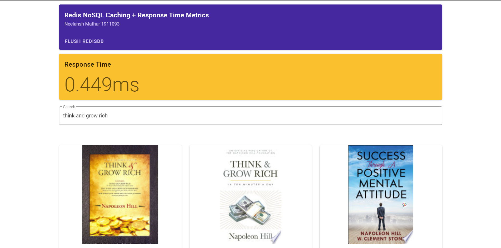
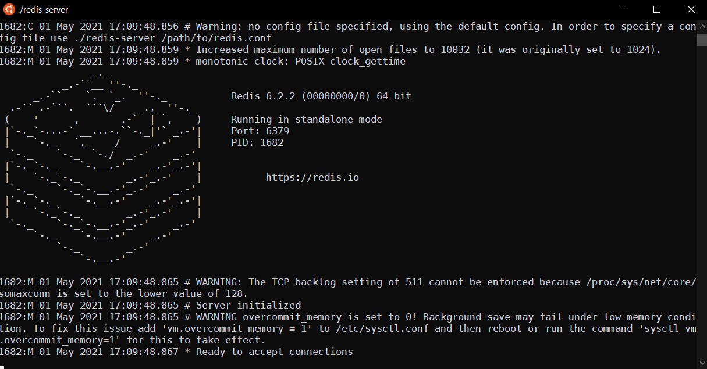

# Node-Redis-Caching
*Less than 1ms* response times. Metrics for API responses with and without a Redis cache.  

The application uses a NodeJS + Express server which calls the Google Books API to fetch top 10 results for the user's query. For each query, if the results array is found in the Redis Cache, it is readily returned. If not, then it is cached for later use.  
Expiration time can be set in a real-world use case but here for testing we don't need it.

# Working
### Without Redis cache


### With Redis Cache (<=1ms response time)


### Redis Server
Redis Server running on `Linux: Ubuntu 18.04 LTS`. The official Redis package works only on Linux and can work with a port on Windows.


# How to Run
## Redis Server
Download Redis from https://redis.io/download. On Linux a simpler way is to run the following commands:
```bash
wget https://download.redis.io/releases/redis-6.2.3.tar.gz
tar xzf redis-6.2.3.tar.gz
cd redis-6.2.3
make
```
  
Then start the server by running `src/redis-server`.

## NodeJS API
You need to have NodeJS installed on your system. If not, install it from https://nodejs.org.  
In this repo's root, first run `yarn` to install the dependencies and then `yarn dev` to run the API. You need this API running along with the Redis server in order to use the 
frontend.

## Frontend: Vue
- cd into the frontend folder: `cd ./frontend`
- Install dependencies: `yarn`
- Run the Vue app: `yarn serve`
  
